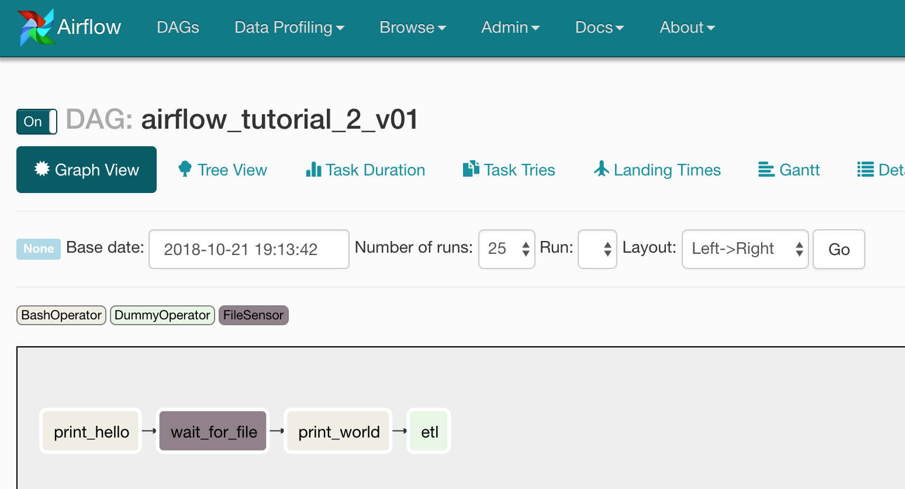
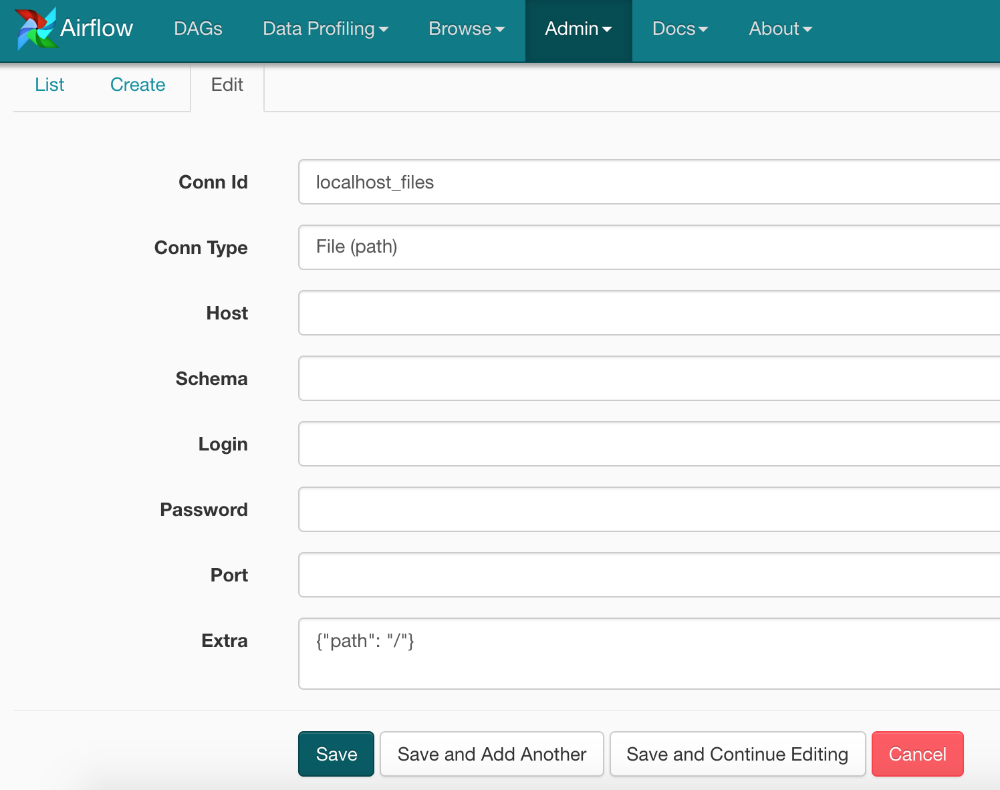
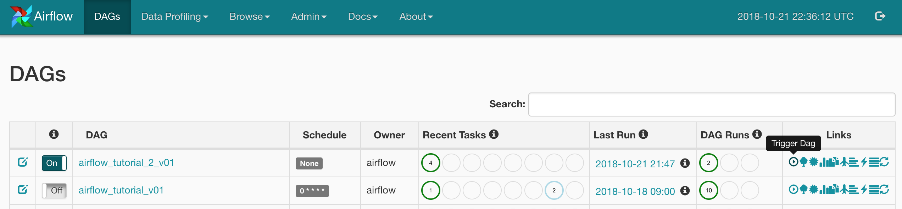
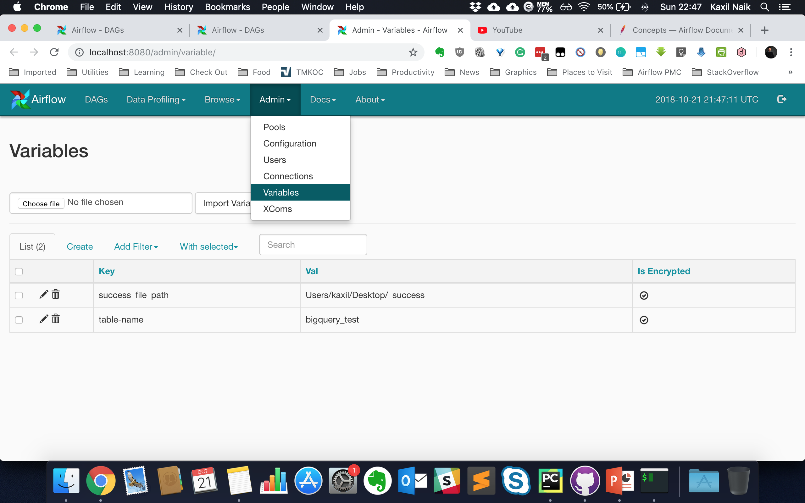

# Tutorial 2

**Goal**: Building a data-aware DAG that is configurable.
**Time**: 15-20 minutes  
**Objectives**: 
* Creating Airflow connection
* Using Airflow variables
* Using sensors


### Workflows


The DAG of this tutorial will consist of the following tasks:

* print `'Hello'`
* wait for the data - to simulate this we will upload a '_success' file
* print `'world. File Received.` 
* use dummy operator for etl

and we'll have `None` as `schedule_interval` as we just want to trigger this DAG manually from the UI.

Create a Python file with the name `tutorial_2.py` that will contain your DAG.



### Using File Sensor

To use the file sensor as below, you will first need to create an Airflow connection to set a Base Path relative to which filepath can be set in filepath. 

The following code waits for a file `_success` in `/Users/kaxil/Desktop` directory. Airflow will wait till this file arrives there. If the file exists or is created, this task is then marked successful.

```python
from airflow.contrib.sensors.file_sensor import FileSensor

file_sensor = FileSensor(
    task_id='wait_for_file',
    filepath='Users/kaxil/Desktop/_success',
    fs_conn_id='localhost_files', 
    dag=dag
)
```

Create a connection as below to set the base path (Airflow -> Admin -> Connections):



You need to add the following in `Extra` field to set the base path as `/` the root of your filesystem:

```json
{"path": "/"}
```

Set the connection type as `File (path)` and add a suitable name as the connection id.

### Dummy Operator

A dummy operator as the name suggest does nothing and just passes. This can be used as a placeholder before you create an actual task.

```python
from airflow.operators.dummy_operator import DummyOperator

etl = DummyOperator(
    task_id='etl',
    dag=dag
)
```

### Run DAG
Create the DAG using the above instructions and copy it to DAGs folder if not already created there. Trigger this DAG from the Web UI:

As shown in the below, click the Trigger DAG button:




Go to Graph View and see that DAG is running and waiting for the file at Sensor task.

Now upload this file manually to the path you have specified in `filepath` variable.

## Exercise
Make the DAG configurable or parameterised by using Airflow variable and removing the hard-coded path `'Users/kaxil/Desktop/_success'`.

### Creating Variables
In the UI, go to Admin -> Variables -> Create



Change the path you specify here or delete the `_success` file so that the Sensor task waits for the file.

You can use an Airflow variable as below:

```python
from airflow.models import Variable

file_path = Variable.get("success_file_path")
```